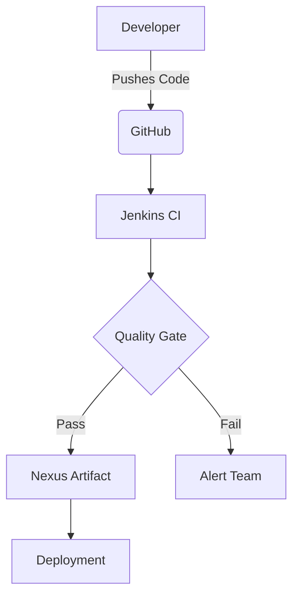

# Jenkins CI/CD Pipeline with Nexus and SonarQube Integration

[](https://opensource.org/licenses/Apache-2.0)


Complete infrastructure-as-code solution for setting up a Jenkins CI/CD pipeline with Nexus artifact repository and SonarQube code quality analysis.



## Quick Start

```bash
# Clone repository
git clone https://github.com/yourusername/jenkins-nexus-sonarqube-ci.git
cd jenkins-nexus-sonarqube-ci

# Run installation scripts
chmod +x installation-scripts/*
./installation-scripts/install_jenkins.sh
./installation-scripts/install_nexus.sh
./installation-scripts/install_sonarqube.sh
```

## Table of Contents

1. [Architecture](#architecture)

2. [Prerequisites](#prerequisites)

3. [Installation](#installation)

4. [Configuration](#configuration)

5. [Pipeline Details](#pipeline-details)

6. [Troubleshooting](#troubleshooting)


## Architecture

 <!-- Add a diagram if possible -->


## Prerequisites

1. AWS EC2 instance (Ubuntu 20.04/22.04 recommended)

2. Security groups configured to allow:

SSH (port 22)

Jenkins web interface (port 8080)

Nexus (port 8081)

SonarQube (port 9000)

3. Basic Linux command line knowledge

4. GitHub repository with Java/Maven project


## Installation

See detailed installation instructions in:

- [Jenkins Setup](installation-scripts/install_jenkins.sh)

Access Jenkins at http://<EC2_PUBLIC_IP>:8080 and complete the setup wizard. The password can be found at

```bash
    sudo cat /var/lib/jenkins/secrets/initialAdminPassword
```

- [Nexus Setup](installation-scripts/install_nexus.sh)

Access Nexus at http://<EC2_PUBLIC_IP>:8081. The admin password can be found at:

```bash
    sudo cat /opt/sonatype-work/nexus3/admin.password
```

- [SonarQube Setup](installation-scripts/install_sonarqube.sh)


## Required Jenkins Plugins

1. Nexus Artifact Uploader

2. SonarQube Scanner

3. Git

4. Pipeline Maven Integration

5. Build Timestamp

6. Pipeline Utility Steps

7. Slack Notification


### Slack Integration

Install the "Slack Notification" plugin in Jenkins

Configure Slack in Jenkins:

1. Go to "Manage Jenkins" → "Configure System"

2. Find "Slack" section

3. Add your Slack workspace URL (e.g., https://your-team.slack.com)

4. Add Slack app credentials (bot token)

5. Test connection and save


### SonarQube Webhook

Access SonarQube at http://<sonar-ip>:9000

Go to Administration → Configuration → Webhooks

Create new webhook:

Name: Jenkins Webhook

URL: http://<jenkins-ip>:8080/sonarqube-webhook/

Save the webhook


## Pipeline Features

✔️ Automatic code checkout  

✔️ Maven build and testing  

✔️ SonarQube code analysis  

✔️ Nexus artifact storage  

✔️ Slack notifications  

✔️ Quality gating  

```bash
def COLOR_MAP = [
    "SUCCESS": 'good',
    "FAILURE": 'danger',
    "UNSTABLE": 'warning',
    "ABORTED": 'warning'
]

pipeline {
    agent any

    tools {
        maven "MAVEN3"
        jdk "JDK17"
    }

    environment {
        SCANNER_HOME = tool 'SONAR_SCANNER'
        PROJECT_VERSION = "1.0.${env.BUILD_NUMBER}"
        PROJECT_NAME = "vprofile"
        NEXUS_URL = 'nexus.example.com:8081'
        NEXUS_CREDENTIALS = credentials('nexus-credentials')
    }

    stages {
        stage('Fetch Code') {
            steps {
                git branch: 'main', 
                   url: 'https://github.com/your-repo/your-project.git',
                   credentialsId: 'github-credentials'
            }
        }

        stage('Build') {
            steps {
                sh 'mvn clean install -DskipTests'
            }
            post {
                success {
                    archiveArtifacts artifacts: '**/target/*.war', 
                                    fingerprint: true
                }
            }
        }

        stage('Unit Tests') {
            steps {
                sh 'mvn test'
            }
            post {
                always {
                    junit '**/target/surefire-reports/*.xml'
                }
            }
        }

        stage('Code Quality Analysis') {
            steps {
                script {
                    withSonarQubeEnv('sonar-server') {
                        sh """
                        ${SCANNER_HOME}/bin/sonar-scanner \
                        -Dsonar.projectKey=${PROJECT_NAME} \
                        -Dsonar.projectName=${PROJECT_NAME} \
                        -Dsonar.projectVersion=${PROJECT_VERSION} \
                        -Dsonar.sources=src/ \
                        -Dsonar.java.binaries=target/classes \
                        -Dsonar.junit.reportsPath=target/surefire-reports \
                        -Dsonar.jacoco.reportsPath=target/jacoco.exec \
                        -Dsonar.java.checkstyle.reportPaths=target/checkstyle-result.xml
                        """
                    }
                }
            }
        }

        stage('Quality Gate') {
            steps {
                timeout(time: 1, unit: 'HOURS') {
                    waitForQualityGate abortPipeline: true
                }
            }
        }

        stage('Deploy to Nexus') {
            steps {
                nexusArtifactUploader(
                    nexusVersion: 'nexus3',
                    protocol: 'http',
                    nexusUrl: NEXUS_URL,
                    groupId: 'com.example',
                    version: "${PROJECT_VERSION}",
                    repository: 'maven-releases',
                    credentialsId: NEXUS_CREDENTIALS,
                    artifacts: [
                        [artifactId: PROJECT_NAME,
                         classifier: '',
                         file: "target/${PROJECT_NAME}.war",
                         type: 'war']
                    ]
                )
            }
        }
    }

    post {
        always {
            script {
                def duration = currentBuild.durationString.replace(' and counting', '')
                def message = """
                *${currentBuild.currentResult}:* Job ${env.JOB_NAME} #${env.BUILD_NUMBER}
                *Duration:* ${duration}
                *Build URL:* ${env.BUILD_URL}
                """.stripIndent()

                slackSend(
                    channel: '#devops-notifications',
                    color: COLOR_MAP[currentBuild.currentResult],
                    message: message
                )
            }
        }
    }
}
```


## Troubleshooting

### Common Issues

Jenkins not starting:

Check Java version: java -version

Check Jenkins logs: sudo journalctl -u jenkins -f


### Nexus not accessible:

Verify service is running: sudo systemctl status nexus

Check firewall rules

Verify admin password exists: sudo cat /opt/sonatype-work/nexus3/admin.password


### SonarQube analysis fails:

Check SonarQube logs: sudo journalctl -u sonarqube -f

Verify database connection in sonar.properties

Check memory settings in sonar.properties


### Pipeline failures:

Always check "Console Output" in Jenkins for detailed error messages

Verify all required plugins are installed

Check credentials and permissions


### Log Locations

Jenkins: /var/log/jenkins/jenkins.log

Nexus: /opt/nexus/sonatype-work/nexus3/log/nexus.log

SonarQube: /opt/sonarqube/logs/

Nginx: /var/log/nginx/


